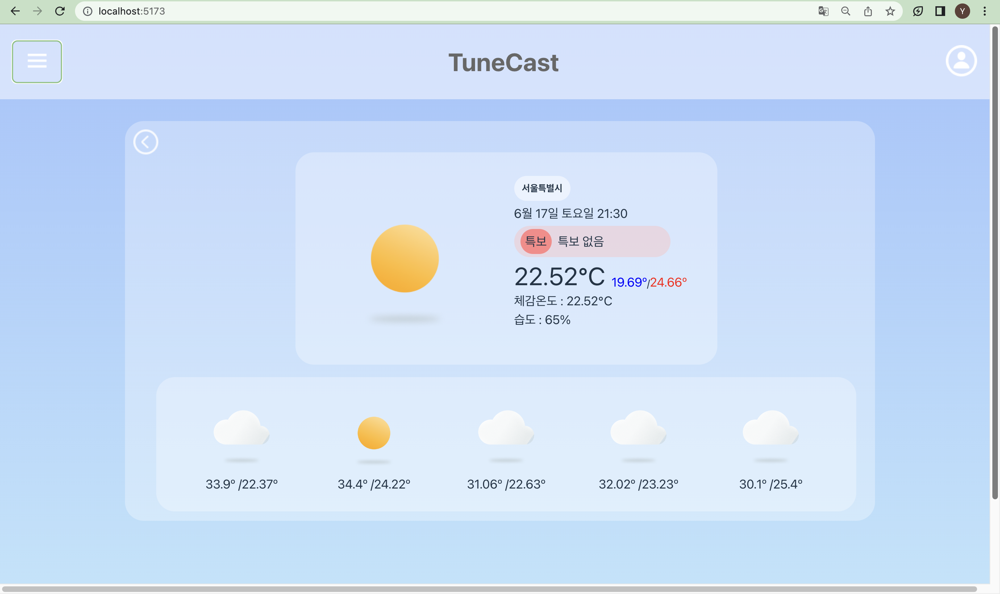
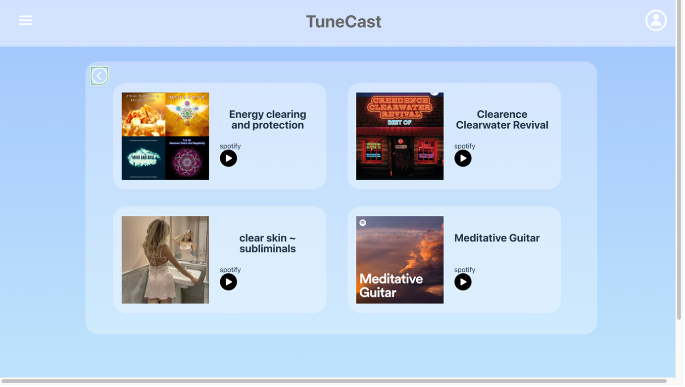
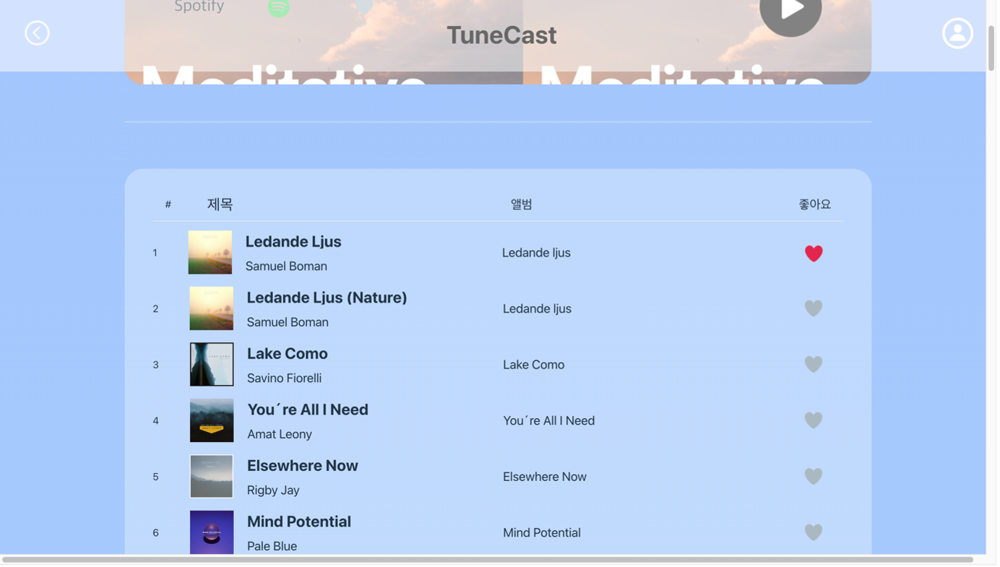
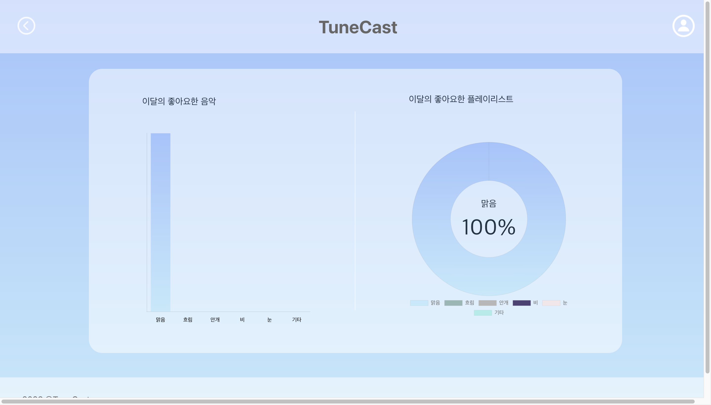
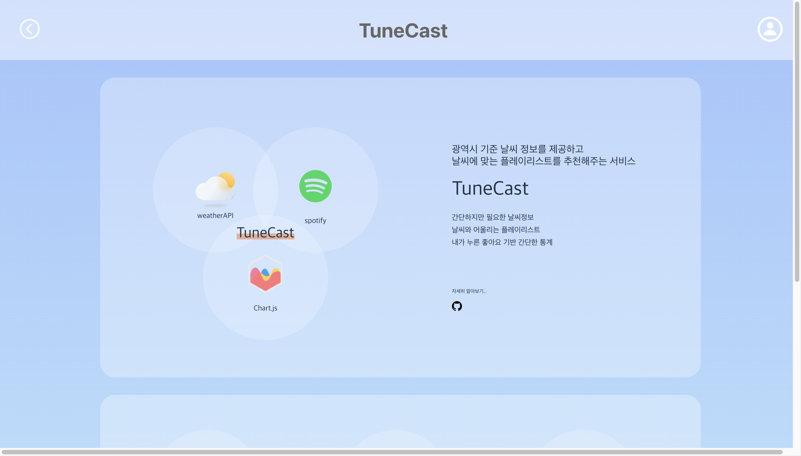

# TuneCast
TuneCast는 스포티파이 API를 기반으로 사용자에게 오늘 날씨에 어울리는 음악을 추천해주는 웹사이트입니다. 

# 기술 스택
   

 
 

# 팀원 소개 
| 역할  | 이름 | 학번 | 담당 |
| :-----: |:----:| :------: | ---------- |
| 팀장  | [김유리](https://github.com/yurik1m) |2020112423| 메인페이지 UI 제작 및 기능구현, 플레이리스트 페이지 UI 수정 및 기능 구현, 컴포넌트 구현
| 팀원   | [전지민](https://github.com/JMM00)|2019113625| 마이페이지 UI 제작 및 기능 구현, 팀 소개 페이지 UI 수정 및 기능 구현, 디자인
| 팀원  | [김영철](https://github.com/kyc7604) | 2019111418| 플레이리스트 페이지 UI 제작, 마이페이지 페이지 UI 제작

 
 

# 목차 
[1. 핵심 기능](#기능)

[2. 페이지 소개](#페이지-소개)

[3. 팀원 소개](#팀원-소개)

[4. 실행 방법](#실행-방법)

 
 

# 핵심 기능
1. 사용자 위치 기반으로 사용자의 현재 위치의 날씨에 맞는 음악 플레이리스트 추천
2. 사용자의 음악 선호도를 파악하여 사용자의 선호에 맞는 음악 플레이리스트 추천 

 
 

# 페이지 소개

## 1. 메인 페이지 ##

- 메인 페이지는 사용자가 위치한 곳의 날씨를 오늘을 시작으로 6일 뒤까지 총 일주일의 날씨를 보여줍니다. 사용자가 지역을 선택하면 그 지역의 날씨를 보여줍니다. 
- 사용자가 메인 페이지로 들어오면 날씨에 맞게 무작위로 플레이리스트가 재생됩니다. 
- 날씨 영역에 있는 오른쪽 버튼을 클릭하면 뒷면으로 갈 수 있습니다. 

 
 

## 2. 메인 페이지(뒷면) ##  

  - 메인 페이지의 뒷면은 날씨에 따라 스포티파이에 검색되는 플레이리스트 4개를 사용자에게 무작위로 제시합니다. 
  - 플레이리스트를 사용자가 선택하면 플레이리스트 페이지로 갈 수 있습니다.
  - 메인 영역의 왼쪽 버튼을 클릭하면 앞면으로 이동할 수 있습니다.

 
 

## 3. 플레이리스트 페이지 ##

- 사용자가 메인 페이지에서 플레이리스트를 선택하면 이동하는 페이지입니다. 사용자가 페이지로 들어왔을 시 플레이리스트를 구성하는 음악 목록이 보여집니다. 
- 음악을 선택하면 그 음악을 재생해주며, 사용자가 좋아요를 누르면 로컬 저장소에 저장, 이후 추천 플레이리스트에 반영됩니다.

 
 

## 4. 마이 페이지 (사용자 페이지) ##

- 헤더에 있는 Avatar 아이콘을 클릭하면 마이 페이지로 이동 가능합니다.
- 사용자가 선택한 좋아요를 통계로 보여줍니다.
- 각 선호도는 각 날씨에 맞게 추천해 준 플레이리스트에 얼마나 좋아요를 많이 눌렀는 지를 기준으로 추천합니다.

 
 

## 5. 웹사이트 소개 페이지 ##

- Footer 영역의 copyright(2023$TuneCast)을 누르면 소개 페이지로 이동 가능합니다.
- 팀원 소개와 웹사이트 프로젝트를 소개하는 페이지입니다.
- Github, Notion 등 프로젝트 정보가 담긴 페이지로 이동할 수 있습니다. 

